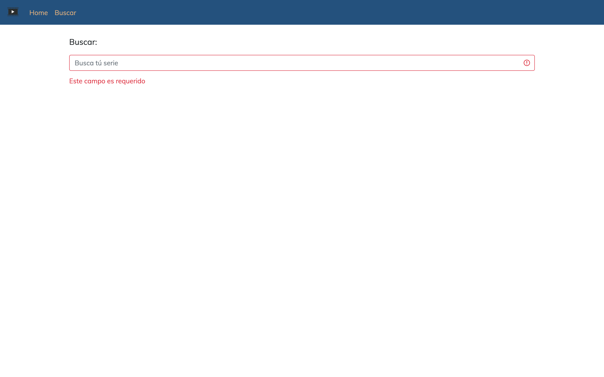
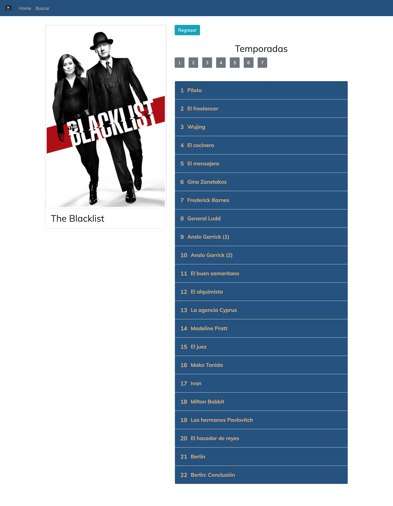

# AppJuniorAranda

## Descripción

Esta aplicación esta desarrollada con Angular version 9.1.7. y utiliza el servicio api de themoviedb

## Comandos a Ejecutar ANGULAR

Para ejecutar el proyecto usar el comando `npm install` y luego `ng serve`. En el navegador se coloca la url `http://localhost:4200/` para visualizar la pagina 

## Imagenes del proyecto 

  
  
  

